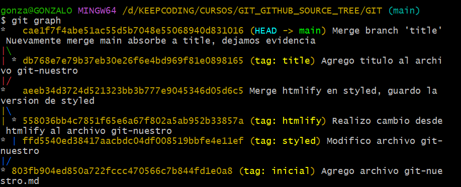

- ¿Qué comando utilizaste en el paso 11? ¿Por qué?
Deshacer el último commit (perdiendo los cambios realizados en el working copy)
Comando    git reset --hard HEAD~1
1.	Mueve el puntero HEAD y la rama actual al commit anterior (HEAD~1).
2.	Descarta todos los cambios en el área de preparación (staging area).
3.	Descarta todos los cambios en el directorio de trabajo (working copy).

- ¿Qué comando o comandos utilizaste en el paso 12? ¿Por qué?
Rehacer el último commit (el que acabamos de deshacer)
1.	Comando git reflog :  Esto mostrará una lista de todas las acciones recientes, incluyendo el commit que deshicimos.
2.	git reset --hard ffd5540 :Una vez identificado el commit, uso su hash para volver a ese estado

- El merge del paso 13, ¿Causó algún conflicto? ¿Por qué?
Hacer un merge con ‘main’ (styled absorbe a main)
No hay conflicto porque git no realiza un merge efectivo. El estado del repositorio permanecería exactamente igual que antes de intentar el merge.
Esto ocurre porque:
•	La rama 'styled' ya contiene todos los commits de 'main'.

- El merge del paso 19, ¿Causó algún conflicto? ¿Por qué?
Hacer un merge de “htmlify” en “styled” (styled absorbe a htmlify)
Si hay conflicto: 
1. Mientras trabajaba en la rama styled, se realizaron cambios en la misma parte del archivo git-nuestro.md en la rama htmlify
2. Fusión de ramas: Al intentar fusionar (merge) la rama htmlify en styled, Git detectó que había cambios incompatibles en el mismo archivo y en las mismas líneas
3. Modificaciones en las mismas líneas: Ambas ramas (styled y htmlify) modificaron las mismas líneas del archivo git-nuestro.md, lo que provocó que Git no pudiera determinar automáticamente qué versión mantener

- El merge del paso 21, ¿Causó algún conflicto? ¿Por qué?
Desde “main”, hacer un merge con “styled”
No hay conflicto:
1.	Historial lineal: La rama "main" no había avanzado desde que se creó la rama "styled". Esto significa que todos los commits en "styled" eran descendientes directos del último commit en "main".
2.	No hubo cambios paralelos: No se realizaron cambios en la rama "main" después de que se creó la rama "styled". Todos los cambios se hicieron exclusivamente en la rama "styled".

- ¿Qué comando o comandos utilizaste en el paso 25?
 Dibujar el diagrama
Tengo configurado  git graph  
git config alias.graph  “git log --graph --decorate --pretty=oneline”

- El merge del paso 26, ¿Podría ser fast forward? ¿Por qué?
Hacer un merge “no fast-forward” de “title” en “main” (main absorbe a title)
1.	Creamos la rama "title" desde "main".
2.	Hicimos cambios en "title" (añadimos un título al archivo).
3.	No hemos hecho cambios adicionales en "main" desde que creamos "title".
En esta situación, "main" no ha avanzado desde que se creó "title", lo que significa que "title" está directamente adelante de "main" en la historia de commits. Por lo tanto, Git podría realizar un merge fast-forward por defecto.

¿Qué comando o comandos utilizaste en el paso 27?
Deshacer el merge (sin perder los cambios del working copy)
Comando git reset --HEAD~1
Esto tendrá los siguientes efectos:
•	El último commit (el merge) se deshará.
•	La rama main se moverá al commit anterior al merge.
•	Los cambios del merge permanecerán en el directorio de trabajo, pero no estarán en el área de staging.

¿Qué comando o comandos utilizaste en el paso 28?
Descartar los cambios
Comando: git restore git-nuestro.md

¿Qué comando o comandos utilizaste en el paso 29?
 Eliminar la rama “title”
 Comando: git branch -D title

¿Qué comando o comandos utilizaste en el paso 30?
Rehacer el merge que hemos deshecho
Comandos:
git reflog para ver el historial de referencias y ubicar el hash
git branch title db768e7 -> hash ultima acción de title
git merge --no-ff title

¿Qué comando o comandos usaste en el paso 32?
Volver al commit inicial cuando se creó el poema
Comandos:
git reflog
git checkout 803fb90 
aquí verificamos el documento y está con el escrito original

¿Qué comando o comandos usaste en el punto 33?
Volver al estado final, cuando pusimos título al poema
Comando:git checkout main

Se muestran último diagrama
Comando    git graph  que tengo configurado

